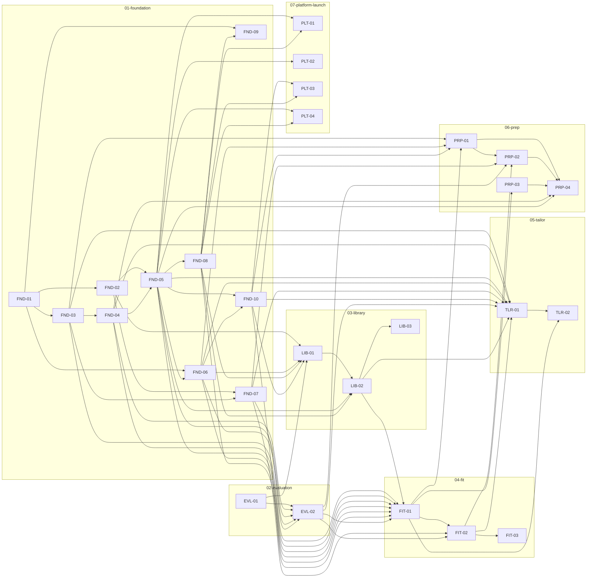

# Groundwork v1 — PRD 拆解计划

| | |
|---|---|
| 版本 | v0.1 |
| 日期 | 2026-07-17 |
| 来源 | [docs/PRD.md](../PRD.md) v2.0 |
| 状态 | Draft → Gate 1 评审 |

本文档是 `docs/PRD.md` 的分解产物：模块切分、文件归属表、票据依赖图、里程碑映射。本文档本身不含任何实现决策的细节——细节在各模块 `README.md`（sub-PRD）与各票据文件中。

---

## 1. 切分原则

模块按**文件写权限边界**切分，不按里程碑切分（里程碑是时间/验收视角，模块是所有权/并行安全视角——两者交叉但不同构，见 §4）。

判据：

1. **共享契约（Zod schema、Drizzle schema、模型/价格/配额 config、校验层类型）先建、单独成模块**——所有下游模块都读它，任何下游模块都不该拥有它的写权限。这是 `01-foundation`。
2. 每个 v1 能力（C1–C5，PRD §3）在文件系统里对应一组不与其他能力重叠的路径（`app/api/**`、`app/(app)/**` 的子树、`lib/**` 的子目录）。这组路径成一个模块。
3. 质量门（PRD §6）的 fixtures 与评测 harness 是横切基础设施，但**不与任何 pipeline stage 的路由文件重叠**（`fixtures/**`、`eval/**` vs. `app/api/**`）——单独成模块 `02-evaluation`，且必须早于第一个需要用 fixture 验收的模块（`03-library`，P1 验收要求 "3 份 fixture 简历解析正确"）交付。
4. 上线基线（C5：配额、隐私、删号、备份、`/admin`、邀请码）在文件系统上只触碰 `01-foundation` 已建好的共享文件（`db/schema.ts` 追加表、`auth.ts` 追加 callback）与自己独有的新路径（`app/(legal)/**`、`app/(admin)/**`），**不触碰任何功能模块（03–06）的文件**——因此它在依赖图上只挂在 `01-foundation` 下，可与 03–06 并行，见 §4。

## 2. 模块清单

| 模块 | 目录 | 一句话 | 票数 | 对应里程碑 |
|---|---|---|---|---|
| 基础设施 | `01-foundation` | 全部共享契约：schema、DB、配置、服务端校验层、鉴权、部署骨架 | 10 | P0 |
| 评测基座 | `02-evaluation` | Fixtures + Q1–Q3 评测 harness（`pnpm eval`），P1–P4 验收门的前置条件 | 2 | 支撑 P1–P4，非独立里程碑 |
| 建库 | `03-library` | PARSE + 草稿确认 + Library 页 + 简历原文持久化（C1） | 3 | P1 |
| 筛（Fit） | `04-fit` | READ + CROSS + SCORE + Job 生命周期 + Fit Report 页（C2） | 3 | P2 |
| 投（Tailor） | `05-tailor` | TAILOR + 对齐表/edits UI + 导出（C3） | 2 | P3 |
| 面（Prep） | `06-prep` | RESEARCH + REHEARSE + 状态门控 + 简报页（C4） | 4 | P4 |
| 上线基线 | `07-platform-launch` | 配额可观测收口、隐私/ToS、删号、备份、`/admin`、邀请码（C5） | 4 | P5 |

**票据总数：28。**

## 3. 全局文件归属表（file-scope allocation）

路径两两不相交；任何被多个模块触碰的文件，所有权归属下表标注的模块，其余模块只能"追加"（append-only：新增导出/新增表/新增字段，不重构既有内容），且只能在被追加文件的所有者模块**已合并**之后动手（模块间顺序执行保证不存在并发竞争，见 §4 的串行安全说明）。

| 路径 glob | 归属模块 | 说明 |
|---|---|---|
| `package.json`, `pnpm-lock.yaml`, `tsconfig.json`, `next.config.mjs`, `vitest.config.ts`, `.env.example` | `01-foundation` | 由 FND-01 创建；`02-evaluation`（追加 `eval` script）、`03`–`07` 的任何票据如需新依赖，只能追加 `dependencies`/`scripts` 字段，不得重写 |
| `app/layout.tsx`, `app/page.tsx`, `app/(auth)/signin/page.tsx` | `01-foundation` | FND-09 创建；`07-platform-launch`（PLT-04）追加邀请码输入框，不重构布局 |
| `auth.ts`, `auth.config.ts`, `middleware.ts`, `lib/auth/session.ts`, `app/api/auth/**` | `01-foundation` | FND-08 创建；PLT-04 追加 `signIn` callback 校验邀请码 |
| `lib/schemas/**` | `01-foundation` | FND-02/03/04；此后任何模块新增的 Zod 类型必须落在自己模块目录下（如 `lib/parse/schema.ts`），不得写回 `lib/schemas/**` |
| `db/schema.ts`, `db/index.ts`, `drizzle.config.ts`, `db/migrations/**` | `01-foundation` | FND-05 创建；PLT-04 追加 `invite_codes` 表（新迁移文件，不改已有表定义） |
| `lib/config/**` | `01-foundation` | FND-06：模型 pin、价格、配额数字与 `checkAndIncrementQuota()` / `checkGlobalBreaker()` |
| `lib/validation/**` | `01-foundation` | FND-07：referential integrity / requirement coverage / number integrity / blacklist，PRD §5.5 四层 |
| `lib/usage/record.ts` | `01-foundation` | FND-10 |
| `.github/workflows/ci.yml` | `01-foundation` | FND-01 |
| `fixtures/**`, `eval/**`, `scripts/eval.mjs` | `02-evaluation` | EVL-01/02，不与任何 `app/**` 或 `lib/**`（除只读 import）重叠 |
| `app/api/parse/route.ts`, `lib/parse/**`, `app/api/library/route.ts`, `lib/db/queries/library.ts`, `app/(app)/library/**` | `03-library` | `lib/db/queries/library.ts` 同时覆盖 `libraries` 与 `resumes` 两张表的查询（LIB-02，见该票据 Background 对早期草稿的修正） |
| `app/api/jobs/route.ts`, `app/api/jobs/[id]/route.ts`, `lib/db/queries/jobs.ts`, `app/api/jobs/[id]/fit/route.ts`, `lib/scoring/**`, `app/(app)/jobs/page.tsx`, `app/(app)/jobs/[id]/layout.tsx`, `app/(app)/jobs/[id]/page.tsx`, `app/(app)/jobs/[id]/_components/**` | `04-fit` | `[id]/layout.tsx` 是 Job 详情三段式 tab 壳，FIT-03 创建；`05`/`06` 只在其**子路由**下新增页面，不改 layout 本身 |
| `app/api/jobs/[id]/tailor/route.ts`, `lib/db/queries/tailored-resumes.ts`, `app/(app)/jobs/[id]/resume/**` | `05-tailor` | TLR-01 读取（不写入）`03-library`/LIB-02 的 `lib/db/queries/library.ts`（`getLibrary`/`getResume`），获取真实源简历文本用于数字完整性校验 |
| `app/api/jobs/[id]/research/route.ts`, `app/api/jobs/[id]/rehearse/route.ts`, `lib/db/queries/briefs.ts`, `app/(app)/jobs/[id]/prep/**` | `06-prep` | |
| `app/(legal)/**`, `app/api/account/delete/route.ts`, `app/(app)/settings/page.tsx`, `.github/workflows/backup.yml`, `docs/ops/backup.md`, `app/(admin)/**`, `lib/db/queries/admin.ts` | `07-platform-launch` | 全新路径，不触碰 03–06 |

## 4. 票据依赖图

节点 = 票据 id；边 `A --> B` 读作"A blocks B"（B 的 `blocked_by` 含 A）。以下 mermaid 与每张票据 frontmatter 的 `blocked_by`/`blocks` 逐条对应，互为镜像。

**并行车道观察**（非强制，供 `/start-milestone` 排期参考）：

- `07-platform-launch` 的全部 4 张票只挂在 `01-foundation` 之下，与 `02`–`06` 的任何票据都没有 `blocked_by` 关系、文件路径也不相交——可以在 `01-foundation` 合并后立刻与 `02`–`06` 并行推进，不必等到 P4 结束。
- `05-tailor` 与 `06-prep` 互相之间没有依赖边（`05` 依赖 `04-fit` + `03-library`/LIB-02；`06` 只依赖 `04-fit`），文件路径不相交（`resume/**` vs `prep/**`，`tailor` 路由 vs `research`/`rehearse` 路由）——可在各自的依赖都合并后并行推进。PRD 的 P3-before-P4 叙事是产品验收顺序，不是技术强制顺序，此处明确记录以免被误当作强制依赖。
- 模块内部（同一 lane）的票据仍按 `blocked_by` 严格串行——`run-milestone` 按 `docs/prd/<module>/tickets/*.md` 的文件名字母序执行（见 `.claude/scripts/publish-tickets.mjs`），因此**票据 id 的数字顺序必须与 `blocked_by` 拓扑序一致**（本计划已保证：每个模块内部 `NN-01 → NN-02 → …` 严格递增）。

## 5. 里程碑映射（PRD §10 P0–P5）

模块 ≠ 里程碑：里程碑是验收视角的横切面，一个里程碑的"完成标准"通常由多个模块的票据共同构成。

| 里程碑 | 完成标准（PRD §10 原文） | 构成票据 |
|---|---|---|
| **P0 骨架** | "注册/登录可用，空应用在线" | `01-foundation` 全部 10 张票；验收关键路径 = FND-01 → FND-05 → FND-08 → FND-09（其余 FND 票是后续里程碑的前置基础设施，P0 本身不依赖它们即可满足验收文案，但按模块单位一并交付） |
| （前置，非里程碑） | 使 P1–P4 的 fixture/judge 类验收可执行 | `02-evaluation` 全部 2 张票，必须先于 `03-library` 交付 |
| **P1 建库** | "3 份 fixture 简历解析正确；空 metrics 状态正确展示" | LIB-01（解析正确性，对 EVL-01 fixtures 断言）、LIB-02（含简历原文持久化）、LIB-03（空 metrics 展示） |
| **P2 Fit** | "Q1 全绿；Q2 接地 ≥ 95%" | FIT-01、FIT-02（Q1/Q2 断言直接写在这两张票的验收清单里，跑 `pnpm eval` 对 EVL-01/02）、FIT-03 |
| **P3 Tailor** | "数字完整性违规 = 0；导出 PDF 达到可直接投递的观感" | TLR-01（数字完整性 = FND-07 number-integrity 层对真实 `Resume.sourceMd` 的机器可断言检查）、TLR-02（导出观感是 `[human]` 验收项，PRD §13 Q2 未决，见 `05-tailor/README.md`） |
| **P4 Prep** | "一个真实 job 全漏斗走通；Q3 ≥ 90%" | PRP-01（RESEARCH）、PRP-02（REHEARSE，Q3 断言）、PRP-03、PRP-04；"全漏斗走通"是 `[human]` dogfood 项，非任何单票的机器验收 |
| **P5 上线** | "上线检查清单全勾；0 号用户完成 ≥ 5 次真实投递 dogfood → public" | PLT-01（隐私/ToS/删号）、PLT-02（备份）、PLT-03（`/admin`）、PLT-04（邀请码）；"≥5 次真实投递"是 `[human]` 项，不产生票据 |

## 6. 开放问题总表

以下问题在各模块 `README.md` 的"开放问题"表中重复列出（带 owner），此处仅汇总以便 Gate 1 一次性审阅。

| # | 问题 | 来源 | Owner | 归属模块 |
|---|---|---|---|---|
| 1 | SCORE 权重与档位切点校准 | PRD §13 Q1 | 已按 §5.1 朴素映射由 FIT-02 落地为 v1 决定；校准动作 owner Horace，触发条件 = V1.1 回填数据 | `04-fit` |
| 2 | 导出保真（打印 CSS 能否达到"可直接投递"观感） | PRD §13 Q2 | Horace（product） | `05-tailor` |
| 3 | RESEARCH 是否前移到 Fit 阶段 | PRD §13 Q3 | Horace（product）——v1 明确不做，只记录 | `06-prep` |
| 4 | 产品名与域名最终确认 | PRD §13 Q4 | Horace（product） | `01-foundation` |
| 5 | 附录 A 资产交接：MVP artifact（`interview-brief.jsx`）、四条已调通 prompts、9 项目 seed library、1 份真实授权简历，均不在本仓库 | PRD 附录A | Horace（product）——需提供文件/路径，或明确"不提供，全部重新产出" | `02-evaluation`（seed library + 真实简历）、`04-fit`（READ/CROSS prompts）、`06-prep`（RESEARCH/REHEARSE prompts + `interview-brief.jsx` UI 参考） |
| 6 | Job 状态机中 `applied`/`closed` 的触发方式未在 PRD 中定义（只有 `interviewing` 的触发写明："用户点击'我拿到面试了'"） | 本次拆解新发现 | Horace（product）——`closed` 的触发方式 v1 不实现，`applied` 由 TLR-02 提供一个手动"标记为已投递"按钮作为保守默认，需 Horace 确认或改设计 | `04-fit`（状态枚举与 PATCH 路由）、`05-tailor`（触发 UI） |
| 7 | `/admin` 页面的管理员鉴权机制未在 PRD 中定义 | 本次拆解新发现 | Horace（product）——PLT-03 默认实现为 env var 邮箱白名单（与 §9 邀请码/预算告警的 env var 风格一致），需 Horace 确认 | `07-platform-launch` |
| 8 | READ+CROSS+SCORE（Fit）与 RESEARCH+REHEARSE（Prep）内部是否应视为单一原子操作、配额在哪一次调用扣减 | 本次拆解新发现，架构选择，硬到不可逆（影响配额语义与 Job 状态机），建议固化为未来 ADR-0001 | Horace（product）+ Architect（后续 ticket-planning 阶段可提 ADR 候选） | `04-fit`、`06-prep` |
| 9 | Vercel 项目创建、环境变量（`ANTHROPIC_API_KEY`/`DATABASE_URL`/`AUTH_SECRET`/`GOOGLE_CLIENT_ID`&`SECRET`/`RESEND_API_KEY`/R2 凭据）配置、域名绑定需要 Horace 的账号权限，agent 无法自行完成 | 本次拆解新发现 | Horace（product/infra） | `01-foundation`、`07-platform-launch` |
| 10（已修复，仅记录） | 初稿曾把 `resumes` 表的持久化遗漏（`03-library`/LIB-02 只写 `libraries`），导致 `05-tailor`/TLR-01 的数字完整性校验只能从 `Library` 字段反推源简历文本，存在漏判/误判风险 | 本次拆解自检发现 | 已在 Gate 1 前修正：LIB-02 现在把 `Library` 与 `Resume.sourceMd` 在同一事务内一起持久化，TLR-01 直接读取真实 `resumeMd`；无需 Horace 裁决，记录仅为审阅可追溯 | `03-library`、`05-tailor` |

## 7. 与本仓库落地方式的对齐说明

- 每个模块的票据文件名数字前缀严格等于其在模块内的构建顺序（供 `publish-tickets.mjs` 的字母序 = `run-milestone` 的执行序）。
- `package.json`、`db/schema.ts`、`auth.ts`、`app/(auth)/signin/page.tsx` 是唯一允许"跨模块追加"的四类文件；每张需要追加它们的票据（EVL-02、PLT-04 等）在自己的 File-scope 段落里显式声明追加范围与串行安全依据。
- `pnpm test`（machine 验收标准套件）由 `01-foundation`/FND-01 创建；`pnpm eval`（Q1–Q3 fixture/judge 套件）由 `02-evaluation`/EVL-02 创建。两者不是同一命令，验收清单中按需引用其一或两者。
